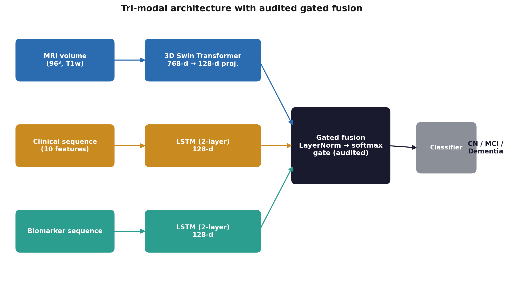
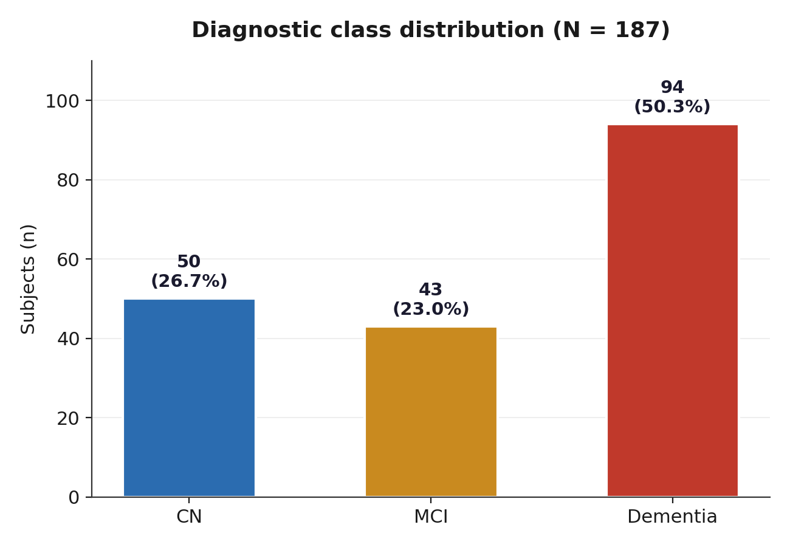
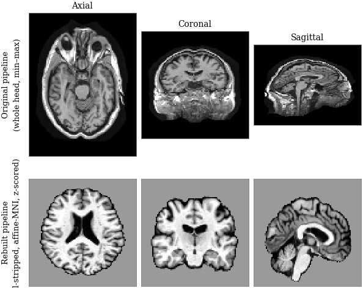
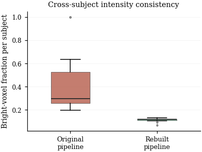
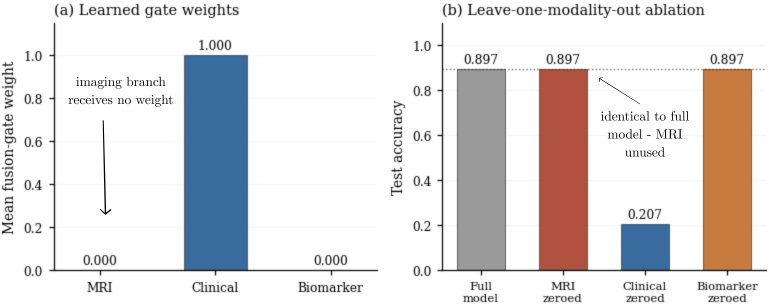
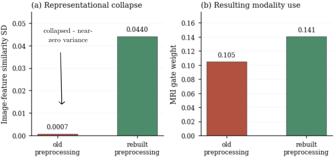
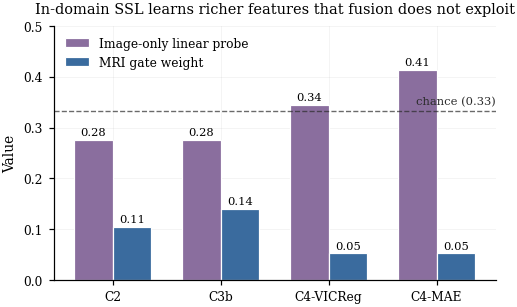
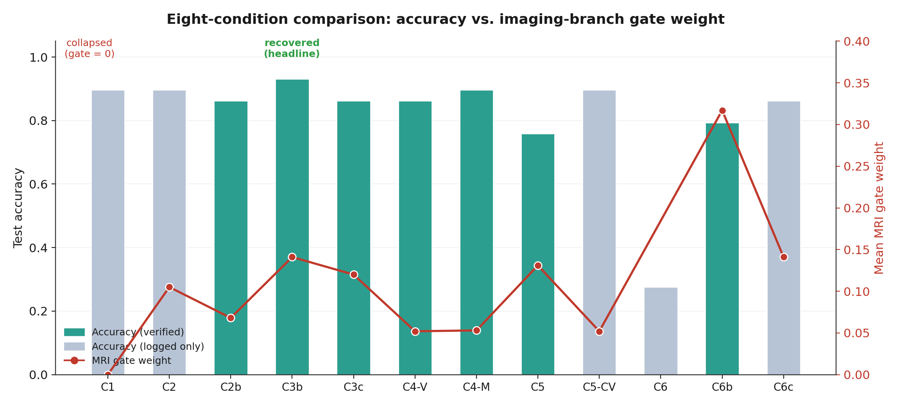
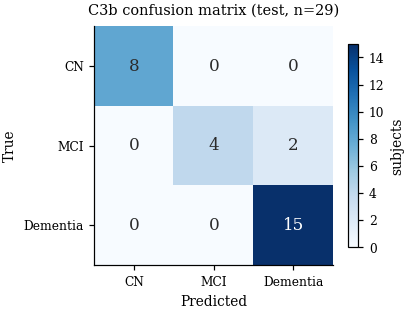

# Modality Present Is Not Modality Used

**Gate-weight auditing and the recovery of a silently collapsed imaging branch in tri-modal Alzheimer's disease classification.**

A tri-modal deep-learning framework for Alzheimer's disease (AD) classification that fuses structural MRI, longitudinal clinical cognitive scores, and biomarker sequences — and a methodology for *auditing* whether each modality is genuinely used rather than merely present. This repository documents Phase 2: the diagnosis of a silent imaging-branch collapse, its recovery, and a controlled eight-condition study establishing the limits of imaging contribution at small sample size.

> **Data note:** This repository contains **no patient data and no trained model weights.** All experiments use the [ADNI](https://adni.loni.usc.edu/) cohort, whose data-use agreement prohibits redistribution. Data must be obtained directly from ADNI. Paths in notebooks are placeholders.

---

## TL;DR

A tri-modal AD classifier reached **89.7%** accuracy — but a gate-weight audit revealed the MRI branch was **completely inert**: the fusion gate assigned it zero weight, and removing MRI changed no test metric. The "multimodal" model was a clinical-feature classifier in disguise.

We traced the collapse to two causes (degenerate MRI preprocessing + a collapsed self-supervised encoder), rebuilt the pipeline, and recovered a genuinely tri-modal model at **93.1%** accuracy (AUC 0.982) where MRI measurably contributes. We then mapped, across eight controlled conditions, the narrow regime in which the imaging branch is viable at N=187.

**Core contribution:** gate-weight auditing distinguishes *modality present* from *modality used* — a distinction invisible to aggregate accuracy, and a necessary check for small-cohort multimodal medical models.

---

## Key results (verified)

| Condition | Configuration | Acc | Acc 95% CI | MCC | G-mean | AUC | MRI gate |
|---|---|---|---|---|---|---|---|
| **C3b** | CT-pretrained frozen + rebuilt preprocessing | **0.931** | **[0.828, 1.000]** | **0.892** | **0.914** | **0.982** | **0.141** |
| C4-MAE | in-domain MAE SSL, frozen | 0.897 | [0.759, 1.000] | 0.840 | 0.865 | 0.950 | 0.053 |
| C2b | CT-pretrained unfrozen, old preprocessing | 0.862 | [0.724, 0.966] | 0.776 | 0.838 | 0.957 | 0.068 |
| C3c | CT-pretrained fine-tuned | 0.862 | [0.724, 0.966] | 0.789 | 0.808 | 0.941 | 0.120 |
| C4-VICReg | in-domain VICReg SSL, frozen | 0.862 | [0.724, 0.966] | 0.774 | 0.849 | 0.982 | 0.052 |
| C6b | gentle forced-utilisation gate | 0.793 | [0.621, 0.931] | 0.660 | 0.754 | 0.935 | 0.317 |
| C5 | MAE + improved gate (dropout 0.3) | 0.759 | [0.586, 0.897] | 0.601 | 0.725 | 0.930 | 0.131 |

Metrics from held-out test (n=29); every row verified by reloading the saved model and reproducing its logged accuracy. CIs are bootstrap 95% (2,000 resamples). See [`results/RESULTS.md`](results/RESULTS.md) for MCC/AUC CIs, cross-validation, and conditions reported from the run log. **Headline C3b, 5-fold CV:** accuracy 0.841 ± 0.046, MCC 0.752 ± 0.076, G-mean 0.862 ± 0.038, AUC 0.888 ± 0.045.

---

## Figures

All figures are generated directly from [`results/verified_metrics.json`](results/verified_metrics.json) and the study's own diagnostic outputs. Fig. 3 shows de-identified, ADNI-derived MRI slices used solely to illustrate the preprocessing pipeline; no raw scan volumes, patient identifiers, or model weights are included in this repository.

### 1 · Model and cohort

<p align="center"><br><sub><b>Fig. 1 — Architecture.</b></sub></p>

MRI → 3D Swin Transformer (SwinViT, frozen or fine-tuned); clinical and biomarker sequences → separate 2-layer LSTMs. Each 128-d modality feature is LayerNorm'd, then combined by a temperature-scaled softmax gate, `w = softmax(g([f_I, f_C, f_B]) / τ)`. The gate weights `w` are the primary object of the auditing protocol.

<p align="center"><br><sub><b>Fig. 2 — Class distribution (N=187).</b></sub></p>

Dementia is the majority class (50.3%, n=94); MCI the smallest (23.0%, n=43) — motivates the imbalance-aware metrics (MCC, G-mean) used throughout.

---

### 2 · Preprocessing rebuild

<p align="center"><br><sub><b>Fig. 3 — Original vs. rebuilt preprocessing.</b></sub></p>

Original pipeline (top: whole-head volumes, min-max scaled) vs. rebuilt pipeline (bottom: skull-stripped with HD-BET, affine-registered to MNI, brain-masked z-scored), shown in all three planes.

<p align="center"><br><sub><b>Fig. 3b — Why the rebuild matters.</b></sub></p>

Bright-voxel fraction per subject: wildly inconsistent under the original pipeline (0.20–1.00) vs. tightly harmonised under the rebuilt one — the input instability that fed the imaging encoder's collapse.

---

### 3 · The audit: collapse and recovery

<p align="center"><br><sub><b>Fig. 4 — Initial audit (baseline C1).</b></sub></p>

(a) Learned gate weights: MRI 0.000, Clinical 1.000, Biomarker 0.000 — the imaging branch receives no weight at all. (b) Leave-one-modality-out ablation: zeroing MRI leaves accuracy unchanged (0.897 → 0.897); zeroing Clinical collapses it (→ 0.207). The imaging branch is present but functionally inert, invisible to accuracy alone.

<p align="center"><br><sub><b>Fig. 5 — Recovery.</b></sub></p>

(a) Image-feature similarity SD: 0.0007 (old preprocessing, collapsed/near-constant features) vs. 0.0440 (rebuilt, de-collapsed). (b) Resulting MRI gate weight rises from 0.105 to 0.141 — the rebuilt pipeline is what restores a genuinely contributing imaging branch.

---

### 4 · Cross-condition results

<p align="center"><br><sub><b>Fig. 6 — Probe-vs-gate dissociation.</b></sub></p>

In-domain self-supervision (C4-MAE: probe 0.41, C4-VICReg: probe 0.34) learns more class-discriminative image features than CT transfer (C2/C3b: probe 0.28, both above chance at 0.33) — yet the fusion gate weights transfer features *more* (0.11–0.14) than the richer in-domain features (0.05). Representation quality and fused contribution dissociate.

<p align="center"><br><sub><b>Fig. 7 — Full condition sweep.</b></sub></p>

(a) MRI gate weight and (b) full-model accuracy across all 12 conditions; (c) accuracy drop when MRI is zeroed (the direct measure of imaging contribution) and (d) image-only linear-probe accuracy. C3b (green) is the only condition that is simultaneously high-accuracy, audit-positive, and CV-stable; C1 (grey) is the inert baseline; red bars mark conditions with an imaging-inert or unstable gate.

<p align="center"><br><sub><b>Fig. 8 — Confusion matrix (C3b, n=29).</b></sub></p>

All errors sit on the MCI/Dementia boundary (2 of 6 MCI subjects predicted as Dementia); CN and Dementia are perfectly classified.

---

## The story in one figure's worth of words

1. **Baseline looks fine, is broken.** 89.7% accuracy; MRI gate weight ≈ 0; zeroing MRI changes nothing. Silent collapse.
2. **Two causes, separated.** Degenerate preprocessing (whole-head volumes, unharmonised intensities) → constant-output collapse. A from-scratch self-supervised encoder → collapsed features.
3. **Recovery.** Skull-strip + affine-to-MNI + brain-masked z-score, with a frozen CT-pretrained encoder → 93.1%, MRI genuinely used (C3b).
4. **The ceiling.** Fine-tuning overfits (C3c); in-domain SSL learns richer features (linear-probe 0.41 vs 0.28) but can't be exploited at N=187 (C4); forced utilisation raises the gate on one split (C6b, gate 0.317) but does not survive cross-validation (C6c → gate ≈ 0.14). Large-scale transfer wins for stability.

---

## Method: the gate-weight auditing protocol

Four diagnostics, applied identically to every condition on the held-out set:

- **Mean gate weights** — the fusion gate's average per-modality allocation. Near-zero = a modality the model ignores.
- **Leave-one-modality-out ablation** — zero each modality; if metrics don't move, it's functionally inert regardless of nominal weight.
- **Image-feature similarity** — std of pairwise cosine similarity among image embeddings; near-zero std = representational collapse.
- **Image-only linear probe** — accuracy of a linear classifier on frozen image features (chance = 0.33); reveals class-discriminative structure independent of whether the gate exploits it.

These separate four states that accuracy conflates: *absent from the gate*, *present but unused*, *collapsed*, and *informative-but-unexploited*.

See [`docs/methodology.md`](docs/methodology.md) for the full pipeline, architecture, and experimental design.

---

## Repository structure

```
.
├── README.md
├── LICENSE                # MIT, with an ADNI data carve-out note
├── requirements.txt
├── notebooks/            # experiment & evaluation notebooks (Drive paths are placeholders)
├── results/
│   ├── RESULTS.md         # full verified table, CIs, cross-validation, provenance
│   └── verified_metrics.json
├── figures/              # paper figures, generated from verified_metrics.json (no patient data)
└── docs/
    └── methodology.md     # cohort, preprocessing, architecture, auditing protocol
```

## Prior work (Phase 1)

The directories below are the original MSc project deliverables. They are kept as-is, physically separate from the Phase 2 work described above:

- `Basic 3D CNN model/` — early unimodal 3D CNN / ResNet18 ensemble baselines.
- `Multimodel/` — preprocessing scripts for the CNN/ResNet and Swin Transformer pipelines.
- `Preprocessing stage 1/` — initial EDA/preprocessing notebook.
- `Proposed Tri Modal Framework with Advanced Gated Fusion/` — first tri-modal framework iteration.
- `Proposed framework of Self Supervised Swin Transformer and LSTM with Cross Modal Attention/` — cross-modal attention variant.
- `Tri Modal Initiative with MAE pretraining and Gated Fusion/` — MAE-pretraining variant that Phase 2's recovery work builds on.
- `notebooks/EDA_of_ADNI_Clinical_data.ipynb` — original clinical-data exploratory analysis.

> **Known issue, flagged for a future cleanup pass:** some Phase 1 scripts still contain generic `/content/drive/...` Colab path placeholders from initial development (no email addresses, credentials, or patient data were found in a repo-wide scan). Sanitizing these requires rewriting already-published git history and is intentionally out of scope for this Phase 2 branch — it needs a separate, explicit sign-off before any history rewrite.

## Reproducing

Data is not included. To reproduce: obtain the ADNI cohort, preprocess per [`docs/methodology.md`](docs/methodology.md) §Preprocessing, set the data-root placeholder in the notebooks, and run the condition notebooks in `notebooks/`. Environment: see [`requirements.txt`](requirements.txt) (note: `monai==1.5.0`; do not pin numpy).

## Limitations

The test set is small (n=29); point estimates carry wide confidence intervals (headline accuracy CI [0.83, 1.00]). Cross-validation supports model selection but does not enlarge the test set. Findings on the imaging-contribution ceiling are specific to this cohort size.

## Citation

If this work is useful, please cite the associated paper (in preparation). Framework and auditing protocol © the authors; ADNI data © the Alzheimer's Disease Neuroimaging Initiative, used under its data-use agreement.

## License

Code released under the MIT License (see `LICENSE`). This license applies to the code only, not to any ADNI-derived data.
